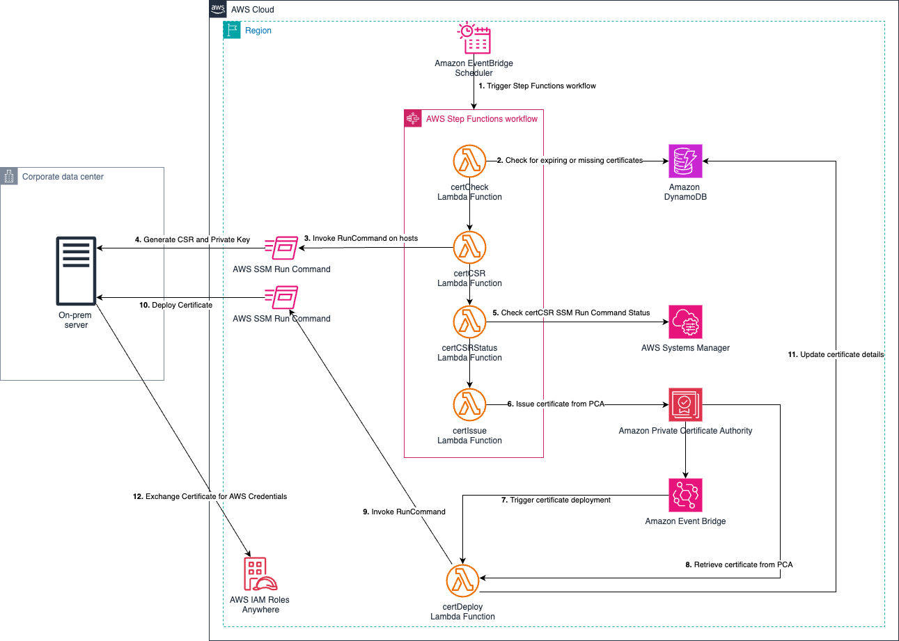

# Automated Certificate Management using AWS Systems Manager (SSM) for IAM Roles Anywhere

## Description
This project provides an architectural pattern and sample code for automating the certificate lifecycle from AWS Private Certificate Authority (PCA) using AWS Systems Manager. This process greatly simplifies the integration of AWS Private Certificate Authority with IAM Roles Anywhere.

## Architecture
The solution comprises multiple stages involving various AWS services:

1.	Amazon EventBridge Scheduler invokes a Lambda function called CertCheck twice daily.
2.	The Lambda function scans a DynamoDB table to identify instances that require certificate management. It specifically targets instances managed by Systems Manager that the administrator populates into the table.
3.	The information about the instances with no certificate and instances requiring new certificates due to expiry of existing ones is received by the CertCheck Lambda function.
4.	Depending on the certificate's expiration date for a particular instance, a second Lambda function called CertIssue is launched. 
5.	The CertIssue Lambda function instructs Systems Manager to apply a Run Command on the instance. 
6.	The Run command generates a Certificate Signing Request (CSR) and a Private Key on the instance.
7.	The CSR is retrieved by Systems Manager, and the private key remains securely on the instance.
8.	The CertIssue Lambda function then retrieves the CSR from Systems Manager.
9.	The CertIssue Lambda function uses the CSR to request a signed certificate from the AWS Private CA service.
10.	On successful certificate issuance, AWS Private CA service launches an event through EventBridge that contains the ID of the newly issued certificate.
11.	This event subsequently invokes a third Lambda function called CertDeploy.
12.	The CertDeploy lambda retrieves the certificate from AWS Private CA and commands Systems Manager to launch a Run Command with the certificate data and updates the certificate's expiration date in the DynamoDB table for future reference.
13.	The Run Command conducts a brief test to verify the certificate's functionality, and upon success, stores the signed certificate on the instance.
14.	The instance can then exchange the certificate for AWS credentials.

Additionally, on a certificate rotation failure, an Amazon Simple Notification Service notification is delivered to an email address specified during the CloudFormation deployment.

## Installation
### Clone the repository
`git@github.com:aws-samples/aws-privateca-certificate-deployment-automator.git`

### Navigate to the cloned repository
`cd aws-privateca-certificate-deployment-automator`

### Run the cloudformation package command
`aws cloudformation package --template-file cf_template.yaml --s3-bucket <bucket_name> --output-template-file packaged.yaml`

### Deploy the CloudFormation stack
`aws cloudformation deploy --template packaged.yaml --stack-name ssm-pca-stack --capabilities CAPABILITY_NAMED_IAM --parameter-overrides "CertPath=/tmp" "CACertPath=/tmp" "CSRPath=/tmp" "KeyPath=/tmp" "SNSSubscriberEmail=pat_candella@example.org"`

After deployment, add the hostID from Systems Manager for hosts that require certificate management into the created DynamoDB table.

## Usage
The CertCheck Lambda function created by the CloudFormation template will run twice daily to ensure the certificates for the hosts are kept up-to-date. If necessary, you can use the AWS cli to run the Lambda function on-demand.
`aws lambda invoke --function-name CertCheck-Trigger --cli-binary-format raw-in-base64-out response.json`

# License

This project is licensed under the MIT License - see the [LICENSE.md](LICENSE.md) file for details.

## Third Party Libraries

This project uses the following libraries in the Lambda layer:

- [cryptography](https://cryptography.io/en/latest/), licensed under the Apache License, Version 2.0 and the BSD 3-Clause License. See the [PyPi page](https://pypi.org/project/cryptography/) and the [GitHub repository](https://github.com/pyca/cryptography) for more information.

- [cffi](https://cffi.readthedocs.io/en/latest/), licensed under the MIT License. See the [PyPi page](https://pypi.org/project/cffi/) and the [GitHub repository](https://github.com/cffi/cffi) for more information.

- [pycparser](https://github.com/eliben/pycparser), licensed under the BSD License. See the [PyPi page](https://pypi.org/project/pycparser/) and the [GitHub repository](https://github.com/eliben/pycparser) for more information.

