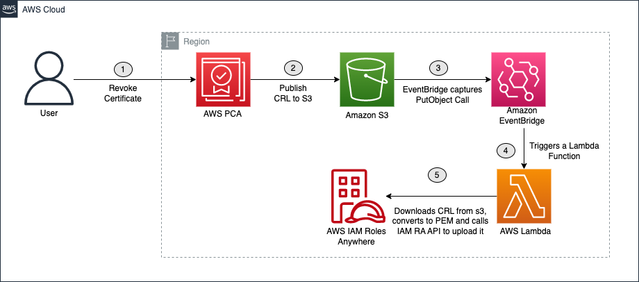

# Automated Certificate Management for PCA using AWS Step Functions and SSM for IAM Roles Anywhere

## Description
This project provides an enterprise-grade architectural pattern and sample code for automating the certificate lifecycle from AWS Private Certificate Authority (PCA) using AWS Step Functions and Systems Manager. This solution is designed to handle large-scale certificate management (10,000+ certificates) with high performance, reliability, and cost efficiency through modern serverless orchestration.

## Architecture
The solution uses AWS Step Functions to orchestrate an asynchronous certificate lifecycle across multiple AWS services, optimized for enterprise scale:

1.	Amazon EventBridge Scheduler triggers a Step Functions workflow twice daily.
2.	The workflow starts by invoking a Lambda function (CertCheck) that scans a DynamoDB table to identify certificates requiring renewal based on configurable thresholds.
3.	The DynamoDB table uses efficient scanning with renewal date filtering to minimize processing overhead.
4.	For each certificate requiring renewal, the Step Functions workflow processes them in parallel (up to 200 concurrent executions for high throughput).
5.	Each certificate renewal follows these asynchronous steps within the workflow:
    - **Generate CSR**: A Lambda function (CertCSR) submits an SSM command to generate a Certificate Signing Request and private key on the target instance, then returns immediately.
    - **Wait and Check Status**: The workflow waits 15 seconds, then checks CSR generation status with intelligent retry logic (up to 12 attempts over 3 minutes).
    - **Issue Certificate**: A Lambda function (CertIssue) uses the completed CSR to request a signed certificate from AWS Private CA.
    - **Wait for Issuance**: The workflow waits for certificate processing using a task token pattern.
6.	On successful certificate issuance, AWS Private CA publishes an event through EventBridge containing the certificate ID.
7.	This event triggers a Lambda function (CertDeploy) that retrieves the certificate from AWS Private CA.
8.	The CertDeploy function uses Systems Manager to deploy the certificate to the instance, validates it with IAM Roles Anywhere, and updates certificate status.
9.	Upon successful validation, the certificate files are stored on the instance and the DynamoDB table is updated with the new expiration and renewal dates.
10.	The instance can then exchange the certificate for AWS credentials using IAM Roles Anywhere.

The Step Functions workflow provides enterprise-grade error handling, intelligent retry logic, and comprehensive monitoring. Certificate failures trigger consolidated Amazon SNS notifications with detailed context to an email address specified during deployment.


## Certificate Revocation
Use the following command to revole a certificate, replacing the placeholders with your own information.

`aws acm-pca revoke-certificate --certificate-authority-arn <certificate-authority-arn> --certificate-serial <certificate-serial> --revocation-reason <revocation-reason>`

Once revoked, AWS Private Certificate Authority will generate a CRL file within 30 minutes and upload it to the CRL S3 bucket that was created by the CloudFormation. From there, the CRLProcessor Lambda function will receive a notification of the new CRL file and pass it to the IAM Roles Anywhere API.



## Project Structure
```
aws-privateca-certificate-deployment-automator/
├── infrastructure/          # CloudFormation templates and deployment configs
│   └── cf_template.yaml    # Main infrastructure template
├── src/lambdas/            # Lambda function source code
│   ├── cert_check/         # Certificate renewal scanning
│   ├── certCSR/           # CSR generation
│   ├── certCSRStatus/     # CSR status checking
│   ├── certIssue/         # Certificate issuance
│   ├── certDeploy/        # Certificate deployment
│   └── crlProcess/        # CRL processing
├── shared/layer/           # Lambda layer with shared dependencies
│   ├── models.py          # Input validation and sanitization
│   ├── error_handler.py   # Structured logging and error handling
│   ├── requirements.txt   # Python dependencies
│   ├── Dockerfile         # Layer build configuration
│   └── build.sh          # Layer build script
└── tests/                 # Test scripts and validation tools
    └── test-failure-scenarios.sh
```

## Installation
### Prerequisites
- AWS CLI configured with appropriate permissions
- An S3 bucket for CloudFormation packaging
- Docker or Podman (for building the Lambda layer)

### Clone the repository
`git clone https://github.com/aws-samples/aws-privateca-certificate-deployment-automator.git`

### Navigate to the cloned repository
`cd aws-privateca-certificate-deployment-automator`

### Build the Lambda layer
`cd shared/layer && ./build.sh && cd ../..`

### Package the CloudFormation template
`aws cloudformation package --template-file infrastructure/cf_template.yaml --s3-bucket <your-deployment-bucket> --output-template-file infrastructure/packaged.yaml`

### Deploy the CloudFormation stack
```bash
aws cloudformation deploy \
  --template-file infrastructure/packaged.yaml \
  --stack-name ssm-pca-stack \
  --capabilities CAPABILITY_NAMED_IAM \
  --parameter-overrides \
    "CertPath=/tmp" \
    "CACertPath=/tmp" \
    "KeyPath=/tmp" \
    "AWSSigningHelperPath=/root" \
    "SNSSubscriberEmail=your-email@example.com" \
    "RenewalThresholdDays=2" \
    "LayerVersion=1.0.0"
```

### Configure certificate hosts
After deployment, add certificate entries to the DynamoDB table for hosts that require certificate management:

```bash
aws dynamodb put-item \
  --table-name <stack-name>-certificates \
  --item '{
    "hostID": {"S": "i-1234567890abcdef0"}
  }'
```

### Test the deployment
Run the included test suite to validate your deployment:

`./tests/test-failure-scenarios.sh <stack-name>`

## Usage
### Automated Operation
The Step Functions workflow runs twice daily (3:15 AM and 3:15 PM UTC) to automatically process certificate renewals. The system will:

- Scan for certificates approaching expiration
- Process up to 200 certificates in parallel
- Generate CSRs on target instances via SSM
- Issue certificates through AWS Private CA
- Deploy and validate certificates
- Send notifications for any failures

### Manual Execution
Trigger the workflow manually when needed:

```bash
aws stepfunctions start-execution \
  --state-machine-arn arn:aws:states:us-east-1:123456789012:stateMachine:ssm-pca-stack-CertificateWorkflow \
  --name manual-execution-20250710143022
```


## Configuration

### CloudFormation Parameters
The following parameters can be customized during deployment:

| Parameter | Default | Description |
|-----------|---------|-------------|
| `CertPath` | `/tmp` | Default path for certificate storage on instances |
| `CACertPath` | `/tmp` | Default path for CA certificate storage |
| `KeyPath` | `/tmp` | Default path for private key storage |
| `AWSSigningHelperPath` | `/root` | Path to AWS Signing Helper binary |
| `SNSSubscriberEmail` | *required* | Email address for failure notifications |
| `RenewalThresholdDays` | `2` | Days before expiry to trigger renewal |
| `SigningAlgorithm` | `SHA256WITHRSA` | Certificate signing algorithm |
| `KeyAlgorithm` | `RSA_2048` | Private key algorithm |
| `LayerVersion` | `1.0.0` | Lambda layer version - increment to force layer updates |

### Per-Host Path Customization
Override default paths for specific hosts by adding attributes to DynamoDB entries:

```json
{
  "hostID": "i-1234567890abcdef0",
  "certPath": "/opt/certificates",
  "keyPath": "/opt/private-keys",
  "cacertPath": "/opt/ca-certificates",
  "signinghelperPath": "/usr/local/bin"
}
```


## Layer Version Management
When updating the Lambda layer (e.g., fixing bugs or adding features):

1. **Make your code changes** in `shared/layer/`
2. **Increment the LayerVersion parameter** during deployment:
   ```bash
   aws cloudformation deploy \
     --template-file infrastructure/packaged.yaml \
     --stack-name ssm-pca-stack \
     --capabilities CAPABILITY_NAMED_IAM \
     --parameter-overrides \
       "LayerVersion=1.0.1" \
       # ... other parameters
   ```
3. **Version numbering**: Use semantic versioning (1.0.1 for patches, 1.1.0 for features, 2.0.0 for breaking changes)


# License

This project is licensed under the MIT License - see the [LICENSE.md](LICENSE.md) file for details.

## Third Party Libraries

This project uses the following libraries in the Lambda layer:

- [cryptography](https://cryptography.io/en/latest/), licensed under the Apache License, Version 2.0 and the BSD 3-Clause License. See the [PyPi page](https://pypi.org/project/cryptography/) and the [GitHub repository](https://github.com/pyca/cryptography) for more information.

- [cffi](https://cffi.readthedocs.io/en/latest/), licensed under the MIT License. See the [PyPi page](https://pypi.org/project/cffi/) and the [GitHub repository](https://github.com/cffi/cffi) for more information.

- [pycparser](https://github.com/eliben/pycparser), licensed under the BSD License. See the [PyPi page](https://pypi.org/project/pycparser/) and the [GitHub repository](https://github.com/eliben/pycparser) for more information.


